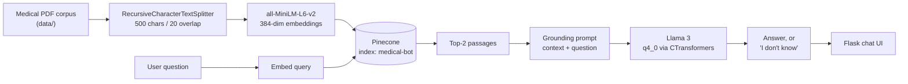

# 🩺 Medical RAG Chatbot

**Medical Q&A grounded in a PDF corpus — built so that "I don't know" is a valid answer.**

[](https://python.org)
[](https://langchain.com)
[](https://llama.meta.com)
[](https://pinecone.io)
[](https://flask.palletsprojects.com)
[](LICENSE)

---

## The problem

Ask a general-purpose LLM a medical question and it will answer — fluently, confidently, and sometimes wrongly. In a medical context that isn't a quirk, it's the entire risk.

This chatbot answers from a specific medical reference corpus and is built to decline when that corpus doesn't cover the question.

## Why refusal is the part worth talking about

Retrieval is the easy half. Chunk, embed, store, search — a solved pipeline, and most RAG tutorials stop there.

The hard half is what happens when retrieval comes back thin. An LLM handed weak context will quietly fall back on its own parametric knowledge, and the user cannot tell the difference — the confident tone is identical either way. In a medical assistant, a plausible-sounding answer assembled from model priors is worse than no answer.

So the system is constructed around a narrower promise: **answer from these documents, or say you can't.**

How that's enforced here:

| Layer | What it does |
|---|---|
| **Grounding prompt** ([`src/prompt.py`](src/prompt.py)) | Instructs the model to answer only from the supplied context and to say it doesn't know rather than improvise |
| **Stuffed context only** | The chain passes retrieved passages as the sole context — there is no fallback path that answers without retrieval |
| **Narrow retrieval (`k=2`)** | Deliberately tight. Fewer, more relevant passages beat a wide net of loosely-related text that gives the model room to drift |
| **Source documents returned** | `return_source_documents=True` — every answer can be traced to the chunks that produced it |

**Where this is honest about its limits:** the refusal behaviour is *prompt-level*, not *score-level*. There is no similarity threshold that blocks generation when the top-`k` passages are poor — if retrieval returns two weakly-related chunks, the model still sees them and decides for itself. Adding that floor is the first item under [What I'd do differently](#what-id-do-differently), and it is the difference between "usually refuses" and "cannot answer ungrounded".

---

## Architecture



### The choices, and why

| Stage | Choice | Reasoning |
|---|---|---|
| Chunking | 500 chars, 20 overlap | Small chunks keep retrieved context tight, which matters more than recall when the goal is grounding. Medical reference text is dense — a 500-char window usually holds one complete idea. |
| Embeddings | `all-MiniLM-L6-v2` | 384 dimensions, runs locally, no API cost. Good enough for single-corpus retrieval; the bottleneck here isn't embedding quality. |
| Vector store | Pinecone | Managed — no index infrastructure to run for a personal project. |
| Retrieval | Top-`k` = 2 | Tight on purpose. More passages means more surface area for the model to wander off. |
| Generation | Llama 3, 4-bit quantised (GGML `q4_0`) via CTransformers | Open weights, runs on CPU, no per-token cost. Quantisation trades some quality for the ability to run it locally at all. |
| Serving | Flask | Small surface. The interesting work is behind the endpoint, not in it. |

---

## Quick start

```bash
git clone https://github.com/MohanVishe/medical-rag-chatbot.git
cd medical-rag-chatbot

python -m venv venv
source venv/bin/activate          # Windows: venv\Scripts\activate
pip install -r requirements.txt
```

**1. Configure credentials**

```bash
cp .env.example .env
# fill in PINECONE_API_KEY and PINECONE_API_ENV
```

**2. Add the corpus** — see [`data/README.md`](data/README.md). The source PDF is not committed; drop your own medical reference PDF into `data/`.

**3. Get the model** — download a Llama 3 GGML `q4_0` build into `model/`. See [`model/instruction.txt`](model/instruction.txt).

**4. Build the index** (once per corpus change)

```bash
python store_index.py
```

**5. Run**

```bash
python app.py     # http://localhost:8080
```

### With Docker

```bash
docker build -t medical-rag-chatbot .
docker run -p 8080:8080 --env-file .env -v "$(pwd)/model:/app/model" medical-rag-chatbot
```

The model file is mounted rather than baked in — a multi-GB weight file has no business inside an image layer.

---

## Layout

```
├── app.py              # Flask app, chat endpoint, RetrievalQA chain
├── store_index.py      # one-time ingestion: load → chunk → embed → Pinecone
├── src/
│   ├── helper.py       # PDF loading, chunking, embedding model
│   └── prompt.py       # the grounding prompt — the core of the refusal behaviour
├── templates/          # chat UI
├── static/             # styles
├── model/              # LLM weights (not committed)
├── data/               # corpus (not committed — see data/README.md)
├── Dockerfile
└── requirements.txt
```

---

## Limitations

Stated plainly, because a medical tool that hides its limits is the problem it claims to solve.

- **Not medical advice.** A retrieval demo over one reference text. Nothing here is validated for clinical use.
- **Coverage is the corpus.** Recall is bounded entirely by the source document. Anything outside it gets declined — by design, but it means the system is only as good as what you feed it.
- **Refusal is not guaranteed.** Prompt-level grounding is substantially better than an unconstrained model, not a hard stop. See the note above.
- **`temperature=0.8` is high** for grounded QA. It was carried over from general chat defaults; a grounding-first system wants it much lower.
- **No conversational memory.** Each question is answered independently — follow-ups that depend on the previous turn won't work.
- **Single-document corpus.** Multi-source retrieval would need reranking and per-source attribution.
- **No evaluation set.** "It refuses well" is currently an observation, not a measurement.

## What I'd do differently

1. **Add a similarity floor** between retrieval and generation. Below it, return the refusal directly and never call the model. This is the single largest correctness gain available and it's roughly twenty lines.
2. **Drop temperature to ~0.1–0.2.** Grounded extraction doesn't want creativity.
3. **Surface citations in the UI.** `return_source_documents=True` is already set and the data is thrown away — showing the passage behind each answer would turn trust from a claim into something the user can check.
4. **Build an evaluation set** of in-scope and out-of-scope questions and measure grounding rate and false-answer rate, so the refusal claim becomes a number.
5. **Reranking** between retrieval and generation — the highest-leverage quality lever left after the floor.
6. **Hybrid search (BM25 + dense).** Medical terminology is exactly where pure semantic search is weakest; exact-term matching would help.

---

## Credits

Frontend help from **Manish Parihar**.

## License

MIT — see [LICENSE](LICENSE).
